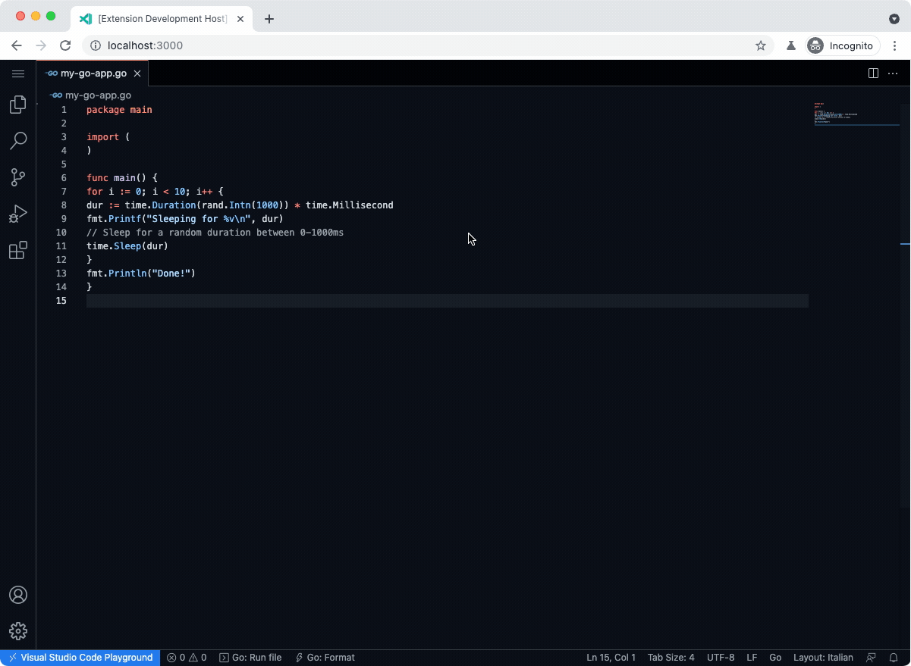

# Go Playground

Run and format Go (Golang) files directly from VS Code, using the Go Playground. This is a web extension that works in VS Code for the Web too, such as github.dev.

## Features

- Run Go files using the Go Playground directly within VS Code
- See your app's output in the Output panel
- Format Go files with `go fmt` through the Go Playground
- Works in the browser with VS Code for the Web, including github.dev

Demo:

## Extension Settings

This extension contributes the following settings:

- `go-playground.playgroundUrl`: URL of the Go Playground to use (default: `https://play.golang.org`)

## Release Notes

See [CHANGELOG.md](./CHANGELOG.md).

## TODO

- [ ] Run multiple Go files at the same time
